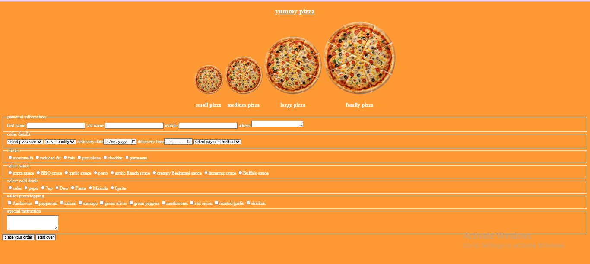

# pizza order form

A clean, structured, and user-friendly pizza ordering web application built using HTML5 and CSS3.

This project demonstrates strong fundamentals in form handling, layout structuring, and semantic HTML design. It allows users to customize and place pizza orders with multiple selectable options in an intuitive interface.

---

## Features

- 👤 Personal Information Collection (Name, Contact, Address)
- 📅 Delivery Date & Time Selection
- 🍕 Pizza Size Options (Small, Medium, Large, Family)
- 🧀 Cheese Selection
- 🥫 Sauce Selection
- 🥓 Toppings Selection
- 🥤 Cold Drink Selection
- 📝 Special Instructions Text Area
- 💳 Payment Method Selection
- ♻️ Reset / Start Over Functionality

---

## Technologies Used

- HTML5  
- CSS3  

---

## Project Preview

---

## Project Objective

This project was built to:

- Practice advanced HTML form structures
- Work with different input types (radio, checkbox, select, textarea, date, time)
- Improve layout organization and semantic grouping
- Strengthen front-end development fundamentals
- Build a realistic, real-world UI scenario

---

## Key Learning Outcomes

- Structuring large and complex forms professionally
- Managing grouped input elements efficiently
- Creating a clean and user-friendly ordering interface
- Improving UI layout clarity and readability

---

## Future Improvements

- Add JavaScript form validation
- Implement dynamic price calculation
- Make the layout fully responsive
- Convert into a React.js version

---

## Author

**Faiza Khan**  
Junior Front-End Developer  
Passionate about building modern and structured web interfaces
